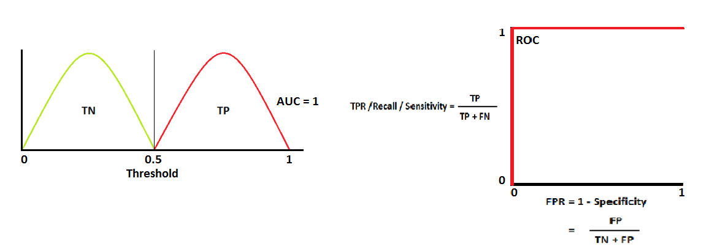
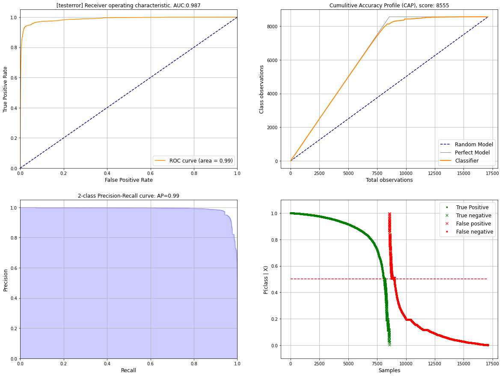
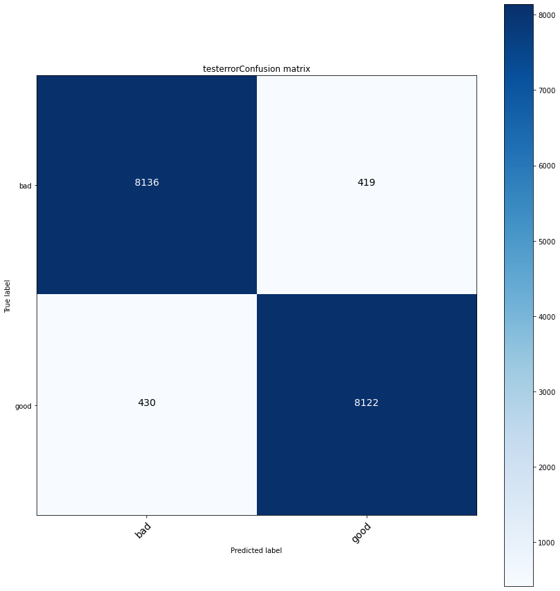
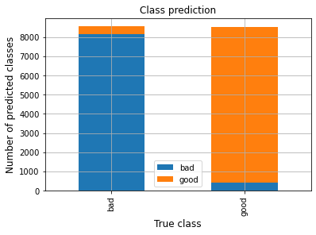

Performance
'''''''''''

To measure the goodness of fit we use various evaluation metrics to check the classification model’s performance.
The performance scores can be derived in ``urldetect`` using in the function :func:`urldetect.plot`.

The performance of the model can deviate based on the threshold being used but the theshold this will not affect the learning process :func:`urldetect.fit_transform`.
After learning a model, and predicting new samples with it, each sample will get a probability belowing to the class. In case of our two-class approach the simple rule account: **P(class malicous) = 1-P(class normal)**
The threshold is used on the probabilities to devide samples into the malicous or normal class.

AUC
---

The Area Under The Curve (AUC) and Receiver Operating Characteristics curve (ROC) are one of the most important evaluation metrics for checking any classification model’s performance. 
In our case we designed a two-class model with URLs being **malicous** or not. The probability ranges between [0-1], and the threshold for classification is set at 0.5, where <0.5 is normal and >0.5 is malicous.
This value can be tweaked to either reduce the number of False positives or True Negatives :func:`urldetect.plot`. 

The goal of the AUC-ROC is to determine the probability curve and degree or measure of separability by using various thresholds settings.
It describes *how much* the model is capable of distinguishing between the classes. The higher the AUC, the better the model is at predicting whereas a AUC of 0.5 represents *random* results.

A perfect score would result in an AUC score=1 and ROC curve like this:

.. _ROC_best:

Confusion matrix
----------------

A confusion matrix is a table that is often used to describe the performance of a classification model (or “classifier”) 
on a set of test data for which the true values are known. It allows the visualization of the performance of an algorithm.

Kappa score
-----------

Cohen's kappa coefficient is a statistic that is used to measure inter-rated reliability for qualitative (categorical) items.

.. code:: python

    scoring = make_scorer(cohen_kappa_score, greater_is_better=True)

Probability graph
-----------------

The probability graph plots the probabilities of the samples being classified.

Results
'''''''

The classification performance can be derived using the function :func:`urldetect.plot`. 
Results for the malicous URLs, using a 5-fold crossvalidation with gridsearch is as follows:

.. _Figure_1:

.. _Figure_2:

.. _Figure_3:

.. raw:: html

	

	

		
	

	

