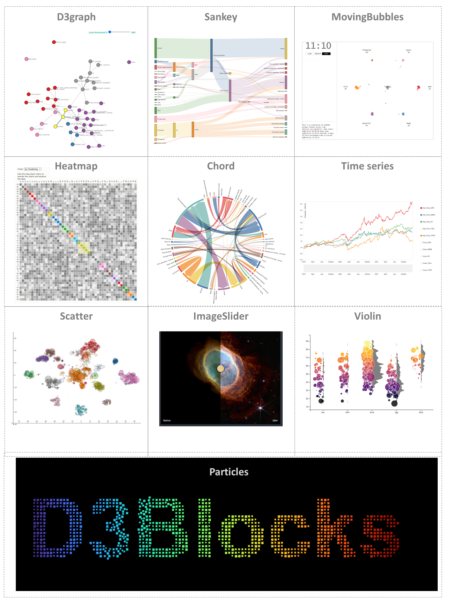

|python| |pypi| |docs| |stars| |LOC| |downloads_month| |downloads_total| |license| |forks| |open issues| |project status| |medium| |colab| |repo-size| |donate|

.. tip::
	`Medium Blog: D3Blocks: The Python library to create stand-alone and interactive D3 charts. <https://towardsdatascience.com/d3blocks-the-python-library-to-create-interactive-and-standalone-d3js-charts-3dda98ce97d4>`_

.. raw:: html

   <iframe src="https://erdogant.github.io\docs\d3blocks\D3Blocks_white.html" height="170px" width="700px", frameBorder="0"></iframe>

D3Blocks builts on the graphics of D3 Javascript to create the most visually attractive and useful charts with only a few lines of Python code.

.. table:: Illustration of the D3Blocks
   :align: center

   +----------+
   | |fig1|   |
   +----------+

-----------------------------------

.. note::
	**Your ❤️ is important to keep maintaining this package.** You can `support <https://d3blocks.github.io/d3blocks/pages/html/Documentation.html>`_ in various ways, have a look at the `sponser page <https://d3blocks.github.io/d3blocks/pages/html/Documentation.html>`_.
	Report bugs, issues and feature extensions at `github <https://github.com/d3blocks/d3blocks/>`_ page.

	.. code-block:: console

	   pip install d3blocks

-----------------------------------

Contents
========

.. toctree::
   :maxdepth: 1
   :caption: Motivation
   
   Motivation

.. toctree::
   :maxdepth: 1
   :caption: Installation
   
   Installation

.. toctree::
   :maxdepth: 1
   :caption: Blocks
   
   Timeseries
   Chord
   d3graph
   elasticgraph
   Sankey
   Heatmap
   MovingBubbles
   Imageslider
   Scatter
   Violin
   Particles
   Treemap

.. toctree::
   :maxdepth: 1
   :caption: Helper functions
   
   helper_functions

.. toctree::
  :maxdepth: 1
  :caption: Documentation

  Documentation
  Coding quality
  d3blocks.d3blocks

Indices and tables
==================

* :ref:`genindex`
* :ref:`modindex`
* :ref:`search`

.. |repo-size| image:: https://img.shields.io/github/repo-size/d3blocks/d3blocks
    :alt: repo-size
    :target: https://img.shields.io/github/repo-size/d3blocks/d3blocks

.. |colab| image:: https://colab.research.google.com/assets/colab-badge.svg
    :alt: Colab example
    :target: https://d3blocks.github.io/d3blocks/pages/html/Documentation.html#colab-notebook

.. |stars| image:: https://img.shields.io/github/stars/d3blocks/d3blocks
    :alt: Stars
    :target: https://img.shields.io/github/stars/d3blocks/d3blocks

.. |python| image:: https://img.shields.io/pypi/pyversions/d3blocks.svg
    :alt: |Python
    :target: https://d3blocks.github.io/d3blocks/

.. |pypi| image:: https://img.shields.io/pypi/v/d3blocks.svg
    :alt: |Python Version
    :target: https://pypi.org/project/d3blocks/

.. |docs| image:: https://img.shields.io/badge/Sphinx-Docs-blue.svg
    :alt: Sphinx documentation
    :target: https://d3blocks.github.io/d3blocks/

.. |LOC| image:: https://sloc.xyz/github/d3blocks/d3blocks/?category=code
    :alt: lines of code
    :target: https://github.com/d3blocks/d3blocks

.. |downloads_month| image:: https://static.pepy.tech/personalized-badge/d3blocks?period=month&units=international_system&left_color=grey&right_color=brightgreen&left_text=PyPI%20downloads/month
    :alt: Downloads per month
    :target: https://pepy.tech/project/d3blocks

.. |downloads_total| image:: https://static.pepy.tech/personalized-badge/d3blocks?period=total&units=international_system&left_color=grey&right_color=brightgreen&left_text=Downloads
    :alt: Downloads in total
    :target: https://pepy.tech/project/d3blocks

.. |license| image:: https://img.shields.io/badge/license-GPL3-green.svg
    :alt: License
    :target: https://github.com/d3blocks/d3blocks/blob/master/LICENSE

.. |forks| image:: https://img.shields.io/github/forks/d3blocks/d3blocks.svg
    :alt: Github Forks
    :target: https://github.com/d3blocks/d3blocks/network

.. |open issues| image:: https://img.shields.io/github/issues/d3blocks/d3blocks.svg
    :alt: Open Issues
    :target: https://github.com/d3blocks/d3blocks/issues

.. |project status| image:: http://www.repostatus.org/badges/latest/active.svg
    :alt: Project Status
    :target: http://www.repostatus.org/#active

.. |medium| image:: https://img.shields.io/badge/Medium-Blog-black.svg
    :alt: Medium Blog
    :target: https://d3blocks.github.io/d3blocks/pages/html/Documentation.html#medium-blog

.. |donate| image:: https://img.shields.io/badge/Support%20this%20project-grey.svg?logo=github%20sponsors
    :alt: donate
    :target: https://d3blocks.github.io/d3blocks/pages/html/Documentation.html#

.. include:: add_bottom.add
