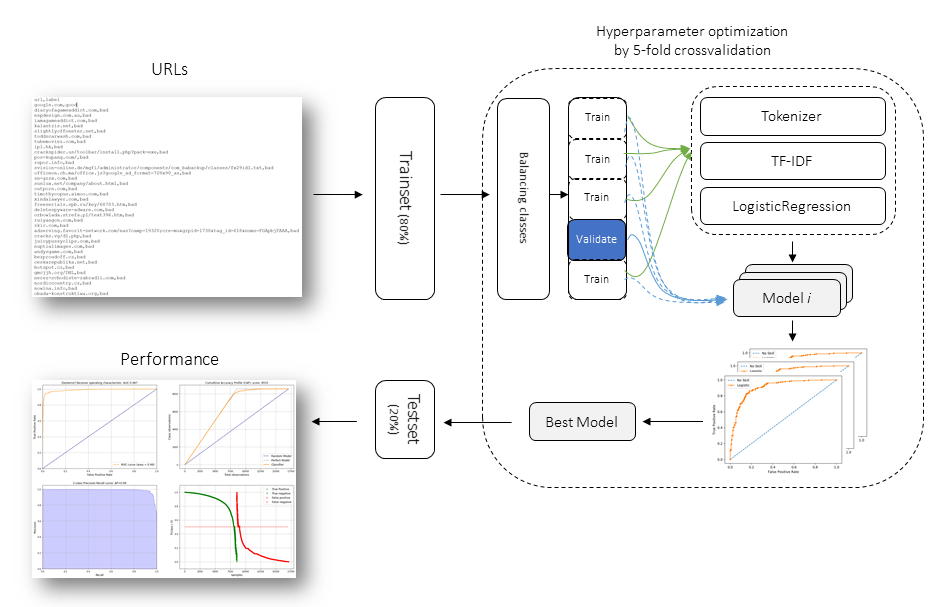

d3blocks's documentation!
========================

*d3blocks* is Python package

.. table:: Schematic overview
   :align: center

   +----------+
   | |fig1|   |
   +----------+

.. tip::
	`Medium Blog: Creating beautiful stand-alone interactive D3 charts with Python <https://towardsdatascience.com/creating-beautiful-stand-alone-interactive-d3-charts-with-python-804117cb95a7>`_

Content
=======

.. toctree::
   :maxdepth: 1
   :caption: Background
   
   Abstract

.. toctree::
   :maxdepth: 1
   :caption: Installation
   
   Installation

.. toctree::
  :maxdepth: 1
  :caption: Methods

  Algorithm
  Cross validation and hyperparameter tuning
  Performance
  Save and Load

.. toctree::
  :maxdepth: 1
  :caption: Examples

  Examples

.. toctree::
  :maxdepth: 1
  :caption: Documentation
  
  Documentation
  Coding quality
  d3blocks.d3blocks

* :ref:`genindex`

Quick install
-------------

.. code-block:: console

   pip install d3blocks

Github
------------------------------

Please report bugs, issues and feature extensions there.
Github, `erdogant/d3blocks <https://github.com/erdogant/d3blocks/>`_.

Citing *d3blocks*
-----------------------

The bibtex can be found in the right side menu at the `github page <https://github.com/erdogant/d3blocks/>`_.

Become a Sponsor
------------------------------

If you like this project, **Star** this repo at the github page and become a **sponsor**!
Read more why this is important on my sponsor page. The **sponsor button** will direct you to the sponsor github page.

.. raw:: html

	<iframe src="https://github.com/sponsors/erdogant/button" title="Sponsor erdogant" height="35" width="116" style="border: 0;"></iframe>

Indices and tables
==================

* :ref:`genindex`
* :ref:`modindex`
* :ref:`search`

.. raw:: html

	

	

		
	

	

